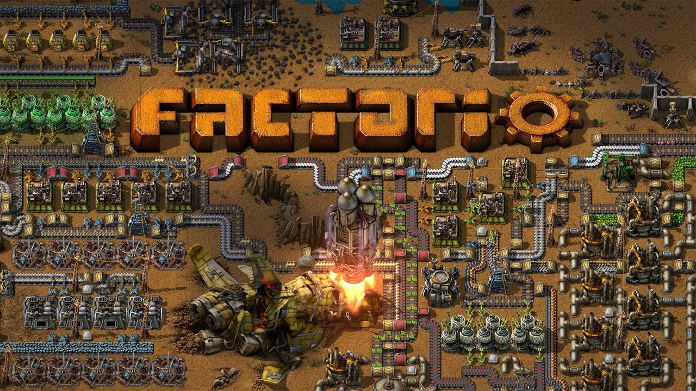

  

It’s pretty crazy to realize how a video game can teach me so many life and business lessons. In this document I detail the various pointers I’ve learnt and observed.

1. **Always keep track of the state of the business/empire -** We need to get access to all kinds of information about the health of the business updated 24x7. And we need to address the numbers that are not showing growth. Once we find a number or a stat that needs fixing we need to address it immediately as it’ll roadblock our growth and journey ahead.

> In factorio we can keep track of a lot of datapoints such as electricity, production, research etc. These data points gives us information and direction on what to do next.

2. **Always build on strong foundations and plan ahead.** If something threatens to disturb our foundation, we need to address it immediately. Building a strong foundation lets us create a plan ahead to build even bigger pieces on top of it.

> In factorio, we build machines and automation that depend on raw materials such as Iron or Copper etc.. Each production of materials leads to build even bigger and more complex items later in the game. Having a shortage of say ‘Green Circuits’ will cause issues immediately or later down the road.

3. **Face problems head on. Deal with issues before they become bigger and serious.** Never leave problems unattended. Face them head on. Make a solution and solve it.

> In factorio, if we do not face enemies head on, they’ll start to attack our base and grow even bigger and stronger if we leave things unattended. If we do not prepare defenses properly, enemies can overpower us as well. This is why it’s important to deal with them early on.

4. **Always push for growth and pursue curiosity.** The more we discover and learn, the more intelligent and resourceful we become.

> In factorio, with the recent addition of new worlds, users can explore a lot of new technologies and interact with a wide range of creatures and resources. Each world is a new learning curve and discovery.

5. **Avoid distractions completely and have a relentless focus on growth:** An un-relentless focus on growth and prioritizing what is important is key.

> In factorio there is a bit of waiting and growing. If we procrastinate on growth, we will not progress in the game and our enemies will become a lot stronger than us. Same thing goes with scaling up and research. If we do not pursue growth we will not progress in the game.

6. **Start small and scale up later:** Focus on growing a minimal viable product and then work your way up to scaling the entire protocol.

> In factorio, this is relevant because we are always increasing the throughput of our factory. We start with a basic factory but then quickly scale up in terms of belt speed, inserter speeds etc etc..

7. **Try to do more with less:** As we continue to scale bigger and bigger, we look to do more with less amounts of resources.

> In factorio, we continuously look to upgrade the speed, productivity and efficiency of our factory, by using beacons, speed/productivity/quality modules, using upgraded machines and researching productivity (mining, research etc etc..). We start to do more with less this way.

8. **Try to forecast the future as much as possible**. The further we can plan ahead the better.

> In factorio, preparing early on in the game for what is about to come next helps players forecast and plan better ahead.
