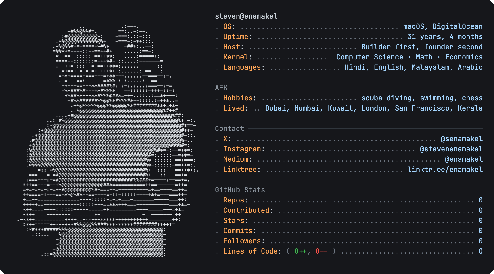

  

<!-- The card above is regenerated daily by .github/workflows/main.yml (today.py -> render.py) -->

# Hi there, I'm **Steven Enamakel** 👋

I'm an engineer specializing in deep-tech, web3, and AI. Builder first, founder second. Optimist and workaholic — my philosophy is to build **compounding value**: things that grow faster because they compound with each other, shipped fast.

## Projects
- 🧠 [**OpenHuman**](https://github.com/tinyhumansai/openhuman) — Open-source personalized AI super-intelligence. Private, simple, powerful. (Rust)
- 🏦 [**ZeroLend**](https://github.com/zerolend/) — Lending protocol for layer-2 blockchains (Linea, zkSync, Blast, Manta).
- 🪙 [**Maha Stablecoin**](https://github.com/mahaxyz) — Protocol contracts and DeFi primitives. Creator of MahaDAO / the ARTH valuecoin.

## Other Open-Source Projects
- 🤖 [TinyAgents](https://github.com/tinyhumansai/tinyagents) — A recursive language-model (RLM) harness for Rust. OpenHuman's core agent harness.
- 🧬 [TinyCortex](https://github.com/tinyhumansai/tinycortex/) — OpenHuman's memory engine, built as a Rust module.
- 🔀 [TinyFlows](https://github.com/tinyhumansai/tinyflows/) — OpenHuman's workflow management infra.

## GitHub Activity

## Connect
- 𝕏 [X — @senamakel](https://x.com/senamakel)
- 📸 [Instagram — @stevenenamakel](https://www.instagram.com/stevenenamakel/)
- ✍️ [Medium — @enamakel](https://medium.com/@enamakel)
- 🌳 [Linktree — linktr.ee/enamakel](https://linktr.ee/enamakel)
- 👤 [about.me — about.me/enamakel](https://about.me/enamakel)
- 🐙 [GitHub — @senamakel](https://github.com/senamakel)

---

### Media
- 🎥 [**Interview: The Creator of MahaDAO**](https://www.youtube.com/watch?v=pQef4I0hGj8) — On building the world's first non-depreciating valuecoin (ARTH) in a community-governed ecosystem.
- 🎙️ [**Matic AMA Recap — MahaDAO Co-Founders**](https://piusimax.medium.com/matic-ama-recap-with-mahadao-co-founders-steven-enamakel-and-pranay-sanghavi-c5cf7f6504a7) — Live AMA on MahaDAO's infrastructure and the valuecoin thesis.

### Philosophy
> "Build compounding value — things that grow faster because they compound with each other. Ship fast at breakneck speed."
